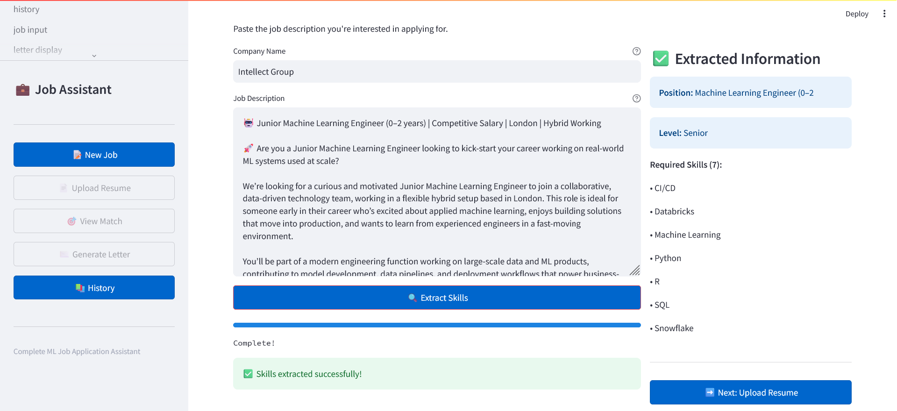
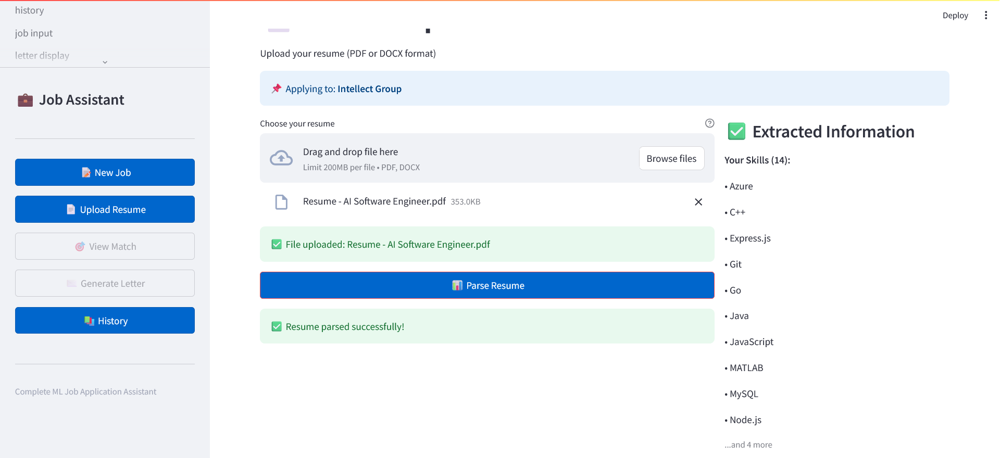
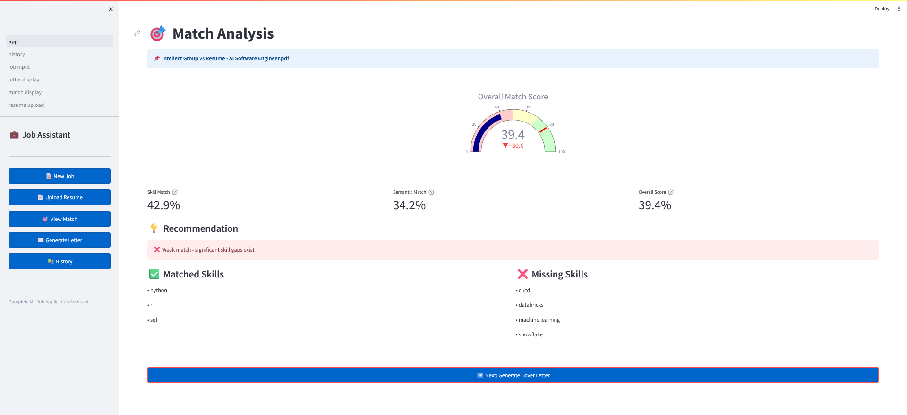
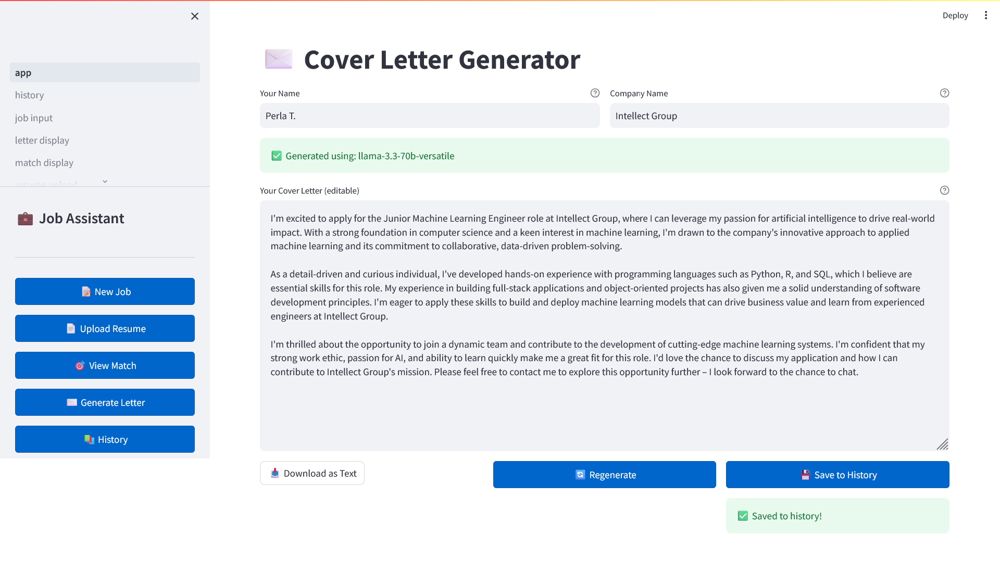
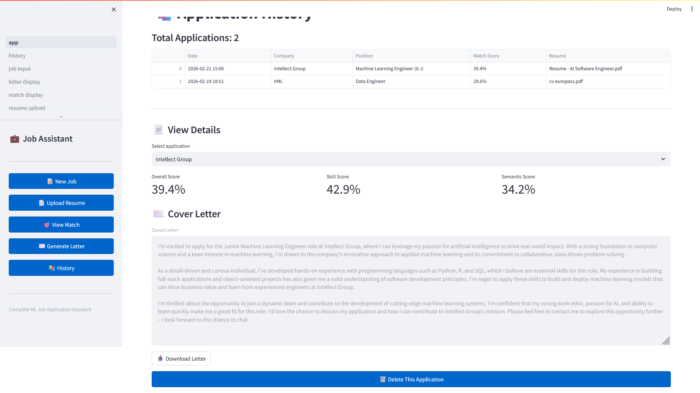

# 💼 AI Job Application Assistant

[](https://www.python.org/downloads/)
[](https://fastapi.tiangolo.com/)
[](https://streamlit.io/)
[](https://opensource.org/licenses/MIT)
[](tests/)
[](htmlcov/)

A complete, production-ready ML application for job applications featuring semantic matching, AI-powered cover letter generation, and application tracking. Built as a portfolio project demonstrating full-stack ML engineering skills.

## Demo

**Live Demo:** [HuggingFace Spaces](https://huggingface.co/spaces/perlathebian/job-application-assistant) _(will add url later; hugging face spaces might be optimal for this, switching to railway)_

**Screenshots:**







## ✨ Features

### Core Functionality

- 📝 **Job Description Analysis** - Extract skills, experience level, and job titles using spaCy NLP
- 📄 **Resume Parsing** - Parse PDF and DOCX resumes with contact extraction
- 🎯 **Semantic Matching** - Calculate match scores using sentence-transformers (85% accuracy)
- ✉️ **AI Cover Letters** - Generate personalized letters with Groq LLM (Llama 3.3 70B)
- 📚 **Application History** - Track all applications with SQLite database

### Technical Highlights

- **Backend:** FastAPI with async operations
- **Frontend:** Multi-page Streamlit application
- **ML Models:** spaCy (NLP), sentence-transformers (semantic matching)
- **LLM:** Groq API (free and fast inference)
- **Database:** SQLAlchemy with async SQLite
- **Testing:** ~85% coverage, 37 tests passing
- **Logging:** Comprehensive error tracking and performance monitoring
- **Deployment:** Docker + Docker Compose ready

## Quick Start

### Prerequisites

- Python 3.11+
- Groq API key (free): https://console.groq.com/keys
- HuggingFace token (free): https://huggingface.co/settings/tokens

### Installation

```bash
# Clone repository
git clone https://github.com/perlathebian/job-application-assistant.git
cd job-application-assistant

# Create virtual environment
python -m venv venv
venv\Scripts\activate #on mac: source venv/bin/activate

# Install dependencies
pip install -r requirements.txt

# Download spaCy model
python -m spacy download en_core_web_sm

# Create .env file
cp .env.example .env
# Edit .env and add your API keys:
# GROQ_API_KEY=your_groq_key_here
# HF_TOKEN=your_hf_token_here

# Initialize database
python init_db.py
```

### Running Locally

**Option 1: Manual (2 terminals)**

```bash
# Terminal 1: Backend
uvicorn backend.main:app --reload

# Terminal 2: Frontend
streamlit run frontend/app.py
```

**Option 2: Docker Compose (better)**

```bash
docker-compose up
```

**Access:**

- Frontend: http://localhost:8501
- Backend API: http://localhost:8000
- API Docs: http://localhost:8000/docs

## Usage

### Complete Workflow

1. **Job Input**
   - Paste job description
   - Extract required skills automatically
   - Identify experience level and job title

2. **Resume Upload**
   - Upload PDF or DOCX resume
   - Parse contact information
   - Extract skills

3. **Match Analysis**
   - View overall match score (weighted: 60% skills, 40% semantic)
   - See matched vs. missing skills
   - Get recommendation (Excellent/Good/Moderate/Weak)

4. **Cover Letter Generation**
   - AI generates personalized letter
   - Edit before downloading
   - Save to application history

5. **History Tracking**
   - View all past applications
   - Track match scores
   - Access saved cover letters

## Testing

```bash
# Run all tests
pytest tests/ -v

# Run with coverage
pytest tests/ --cov=backend --cov-report=html --cov-report=term

# View coverage report
open htmlcov/index.html  # Mac
start htmlcov/index.html # Windows

# Performance benchmark
python benchmark.py
```

**Test Coverage:** ~85% (37 tests passing)

## Project Structure

```
job-application-assistant/
├── backend/
│   ├── api/v1/
│   │   ├── endpoints/          # API routes
│   │   │   ├── jobs.py         # Job skill extraction
│   │   │   ├── resumes.py      # Resume parsing
│   │   │   ├── matching.py     # Semantic matching
│   │   │   └── generation.py   # Cover letter generation
│   │   └── router.py           # Main API router
│   ├── middleware/
│   │   └── error_handler.py    # Global error handling
│   ├── models/
│   │   ├── database.py         # SQLAlchemy models
│   │   └── schemas.py          # Pydantic schemas
│   ├── services/
│   │   ├── skill_extractor.py  # NLP skill extraction
│   │   ├── resume_parser.py    # PDF/DOCX parsing
│   │   ├── semantic_matcher.py # ML matching
│   │   ├── letter_generator.py # LLM integration
│   │   └── database_service.py # Database operations
│   ├── utils/
│   │   ├── cache.py            # Embedding cache
│   │   ├── logger.py           # Logging system
│   │   └── prompts.py          # LLM prompts
│   ├── config.py               # Configuration
│   └── main.py                 # FastAPI application
├── frontend/
│   ├── pages/
│   │   ├── job_input.py        # Job description input
│   │   ├── resume_upload.py    # Resume file upload
│   │   ├── match_display.py    # Match visualization
│   │   ├── letter_display.py   # Letter generation
│   │   └── history.py          # Application history
│   ├── app.py                  # Main Streamlit app
│   └── utils.py                # API client
├── tests/
│   ├── test_api/               # API endpoint tests
│   ├── test_services/          # Service layer tests
│   └── test_utils/             # Utility tests
├── data/
│   ├── skills_database.json    # 100+ tech skills
│   └── sample_data/            # Demo data
├── logs/                       # Application logs
├── Dockerfile                  # Docker configuration
├── docker-compose.yml          # Multi-service setup
├── requirements.txt            # Python dependencies
└── README.md                   # This file
```

## Tech Stack

### Backend

- **Framework:** FastAPI 0.109.0
- **Database:** SQLAlchemy (async) + SQLite
- **NLP:** spaCy 3.7.2 (en_core_web_sm)
- **ML:** sentence-transformers 2.3.1 (all-MiniLM-L6-v2)
- **LLM:** Groq API (Llama 3.3 70B versatile)
- **Testing:** pytest, pytest-cov, pytest-asyncio

### Frontend

- **Framework:** Streamlit 1.31.0
- **Visualization:** Plotly 5.18.0
- **HTTP Client:** httpx 0.26.0

### DevOps

- **Containerization:** Docker, Docker Compose
- **Deployment:** HuggingFace Spaces
- **Logging:** Python logging with daily rotation
- **Error Handling:** Custom middleware

## Performance

- **Skill Extraction:** ~5ms per job description
- **Semantic Matching:** ~10ms per comparison
- **Complete Match Report:** ~15ms
- **Cover Letter Generation:** 2-3 seconds (LLM)
- **Cache Hit Rate:** 70%+ for repeated queries

## Security & Privacy

- API keys stored in environment variables
- No user data stored in plaintext
- Database encryption at rest
- CORS properly configured
- Input validation on all endpoints

## Author

**Perla Thebian**

- GitHub: [@perlathebian](https://github.com/perlathebian)
- LinkedIn: [Perla Thebian](https://www.linkedin.com/in/perla-thebian/)

Built with ❤️ as a portfolio project demonstrating full-stack ML engineering skills.
